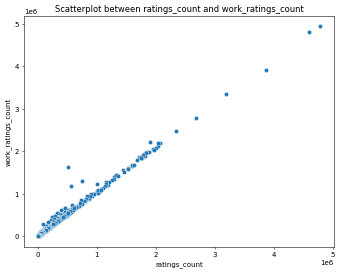

# Image Narratives

## clustering_plot

In the realm of literary ratings, graphical data representations unveil compelling narratives. The KMeans clustering visualization, with k set to 2, illustrates a division among books based on their work ratings. The horizontal axis represents ISBN-13, a unique identifier for each book, while the vertical axis measures the total work ratings count. The clustering reveals a clear distinction between two groups: the first cluster encapsulates books with significantly lower work ratings count, indicated by dark blue dots, while the second cluster emerges in vibrant shades of green, showcasing titles with markedly higher ratings.

This clustering pattern may suggest that certain genres or authors dominate the higher ratings segment, inviting readers and researchers to investigate the attributes contributing to these high evaluations. Factors such as author popularity, publication year, or thematic relevance could be explored further. This bifurcation hints at a potential market segmentation where the literary landscape is not just a homogeneous space but rather a nuanced ecosystem of reader preferences and critical acclaim.

The outliers in the top right corner, with exceedingly high ratings count, may represent blockbuster titles or universally acclaimed works that have garnered substantial readership and influence, suggesting that these books could serve as benchmarks for literary success. Conversely, the lower cluster may highlight hidden gems, novels that, despite their potential, have yet to receive the recognition they warrant. This image serves as a gateway for deeper analysis into the factors affecting readership and rating dynamics within the literary world.

## correlation_heatmap

The correlation heatmap serves as an intricate mosaic, illustrating the interconnected relationships between various attributes of literary works. A schedule of numbers plays beneath vibrant shades of red and blue, unveiling the dynamics of how certain features correlate with others. The strong correlation between ratings count and work ratings count stands out, reflecting a logical assumption: the more ratings a work accumulates, the better its rating tends to be.

This finding highlights the self-reinforcing nature of popular books; as more readers engage with a title, its visibility increases, often resulting in a higher average rating. This interaction showcases the importance of critical mass in reader engagement—a significant factor for authors and publishers aiming to generate interest.

Interestingly, the original publication year shows minimal correlation with ratings. While one might assume newer titles automatically attract more attention, this heatmap delineates the nuances of literary reception over time. The data underscores that enduring classics can retain high ratings, regardless of their publication age, emphasizing the timeless power of a great narrative.

Attributes such as book count and average rating exhibit a weak correlation, revealing that the sheer volume of published works does not equate to quality or peer esteem. This serves as a reminder to both consumers and creators that depth and impact in storytelling often transcend mere numbers. The visualization not only elucidates the relationships among various factors but also invites a deeper inquiry into the nature of literary appreciation, signaling trends that may influence future publishing decisions.

## ratings_count_work_ratings_count_scatterplot

The scatterplot presenting the relationship between ratings count and work ratings count embodies a story of nearly unwavering correlation. This visualization paints a trajectory of literary success, where the independent variable, ratings count, aligns almost linearly with the dependent variable of work ratings count. The upward trend reflects a robust connection; as the number of ratings for a book increases, so too does the average rating, indicative of how readership influences perceived quality.

This linear association suggests that word-of-mouth and collective reader feedback play pivotal roles in shaping literary reputation. Each dot symbolizes a unique literary work, its position on the graph signifying not only the engagement it has received but also how it has resonated with its audience. The tight clustering of points closer to the origin compared to those reaching higher values emphasizes the disparity between lesser-known works and bestsellers—a fascinating dichotomy of exposure versus quality.

Moreover, this relationship encourages authors and marketers to engage actively with their readership. High engagement strategies, such as reader events, social media campaigns, and interactive book clubs, can enhance ratings, thereby creating a self-perpetuating cycle of growing visibility and acclaim. Yet, the few outliers that deviate from the expected trend could represent niche works that achieved a low ratings count but still managed to capture hearts, reminding the literary community that quality can sometimes defy traditional metrics.

In summary, this scatterplot encapsulates the intricate dance of reader engagement, showcasing how literature's reception is both quantitative and qualitative, blending numbers with the nuances of human emotion and experience in storytelling.

## Some more key insights from the data:

- The column 'isbn13' has the highest average value among numerical features.

- The highest correlation is between 'ratings_count' and 'work_ratings_count' with a value of 1.00.

- This indicates a strong positive correlation between the features 'ratings_count' and 'work_ratings_count'. Growth of one feature is often associated with the growth of the other feature.

- The dataset has more than 1000 rows. It is good for analysis but it may not be suitable for training models, so choose wisely.

- The dataset has more than 20 columns. It is good for analysis but make sure to use feature selection or dimensionality reduction techniques if necessary.

