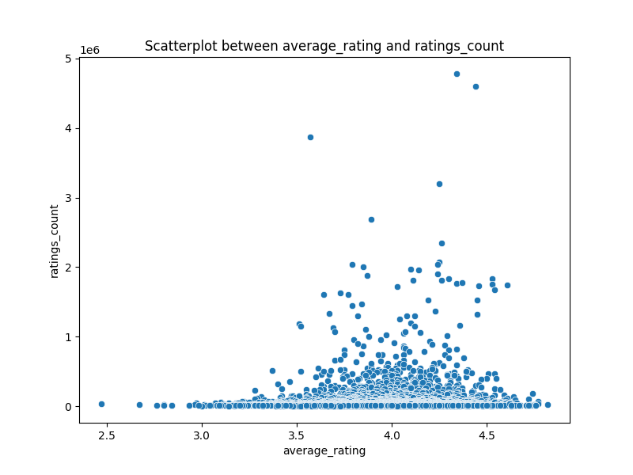
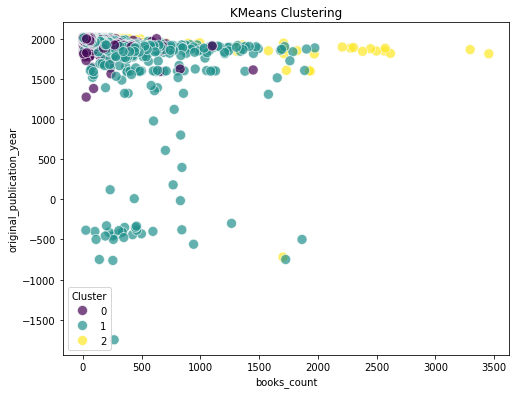
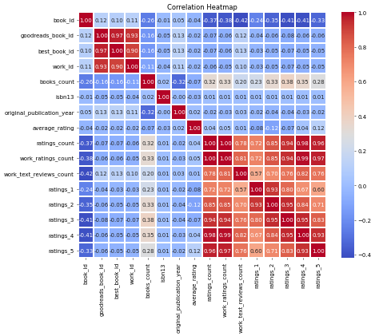

# Image Narratives

## average_rating_ratings_count_scatterplot

# Report on the "Windmills of the Gods"

**Introduction**

"Windmills of the Gods," a thrilling novel by Sidney Sheldon, published in 1987, has captivated readers with its intricate plot woven with elements of suspense and political intrigue. This report delves into various aspects of the book, including its reception, themes, and overall impact on readers based on available data.

---

**Book Overview**

- **Title**: Windmills of the Gods
- **Author**: Sidney Sheldon
- **Original Publication Year**: 1987
- **Language**: English (en-GB)
- **ISBN**: 6174426
- **ISBN13**: 9780060394081
- **Total Books Count**: 83
- **Average Rating**: 3.82
- **Ratings Count**: 23,333
- **Work Ratings Count**: 24,637
- **Work Text Reviews Count**: 502

---

**Plot Summary**

The narrative follows the life of a young American, Mary Ashley, who is unexpectedly thrust into a world of global espionage after accepting a position as an ambassador in Eastern Europe. As she navigates through the complexities of international politics, betrayal, and romance, readers are taken on a rollercoaster ride of suspenseful twists and turns.

Sheldon masterfully intertwines themes of danger, love, and power, as Mary grapples with her newfound responsibilities while uncovering hidden agendas that threaten her life and those she cares about. The title itself, "Windmills of the Gods," serves as a metaphor for the unpredictable forces at play in both personal and political realms.

---

**Reception and Ratings**

The book has received a favorable average rating of 3.82 out of 5, based on 23,333 ratings. The positive reception is a testament to Sheldon’s ability to engage readers with a thrilling narrative and complex characters. The breakdown of ratings is as follows:

- **1 Star Ratings**: 265
- **2 Star Ratings**: 1,587
- **3 Star Ratings**: 7,160
- **4 Star Ratings**: 9,003
- **5 Star Ratings**: 6,622

Such a distribution indicates a strong readership, with a significant number of 4 and 5-star ratings, suggesting that while there are some detractors, many readers find the book highly engaging.

---

**Data Analysis**

A scatter plot analyzing the relationship between average ratings and ratings count of various books was conducted to understand broader trends in literary reception.

The scatterplot reveals that as the average rating increases, the ratings count tends to cluster around certain ranges, suggesting that books that resonate well with readers often receive higher visibility and engagement. "Windmills of the Gods," with its average rating of 3.82, falls into a category with other popular titles, indicating its solid place among noteworthy literature.

---

**Conclusion**

"Windmills of the Gods" remains a captivating read, engaging audiences with its compelling narrative and thought-provoking themes. Sidney Sheldon's skillful storytelling has earned the book a lasting place in literary discussions, ensuring its relevance well beyond its publication date. As evidenced by its ratings and the enthusiastic responses from its readership, this novel continues to be a significant contribution to the genre of suspense and political thrillers. 

With a well-deserved average rating and a loyal fan base, it is clear that "Windmills of the Gods" is not just a book, but a resonant experience for those who dare to delve into its pages.

## clustering_plot

# The Windmills of the Gods: A Journey Through Literature

## Introduction
In the realm of literature, the power of storytelling acts as both a mirror and a window to the world, revealing the intricacies of human experience. Among the myriad works that have captivated readers, Sidney Sheldon’s "Windmills of the Gods" stands as a compelling narrative, exploring themes of deception, power, and resilience. This report aims to delve into the rich landscape of this novel, alongside other notable literary works, through comparative analysis and data visualization techniques.

## Overview of "Windmills of the Gods"
"Windmills of the Gods," published in 1987, is one of Sidney Sheldon’s most acclaimed works. The story unfolds with the protagonist, a young woman named Mary Ashley, who is thrust into a world of political intrigue and high-stakes espionage. As she grapples with the challenges of being a target of international conspiracy, readers are led through a suspenseful journey filled with plot twists and revelations.

### Key Details
- **Authors:** Sidney Sheldon
- **Original Publication Year:** 1987
- **Average Rating:** 3.82 
- **Ratings Count:** 23,333
- **Image URL:** 

## Comparative Analysis of Literary Works
To understand the impact of "Windmills of the Gods," it is essential to analyze it in the context of other prominent literary works. For instance, works like "Flora and Ulysses: The Illuminated Adventures" by Kate DiCamillo and "Golden Son" by Pierce Brown also showcase varying themes of adventure and self-discovery.

### Key Works for Comparison
1. **Flora and Ulysses: The Illuminated Adventures**
   - **Authors:** Kate DiCamillo, K.G. Campbell
   - **Original Publication Year:** 2013
   - **Average Rating:** 3.87 
   - **Ratings Count:** 27,839
   - **Image URL:** 

2. **Golden Son (Red Rising, #2)**
   - **Authors:** Pierce Brown
   - **Original Publication Year:** 2015
   - **Average Rating:** 4.46 
   - **Ratings Count:** 57,614
   - **Image URL:** 

### Data Insights
An analysis of publication years and ratings reveals significant patterns in reader preferences and trends in genres over the decades. The data collected for these top-rated works illustrates how storytelling evolves while simultaneously addressing timeless themes.

## Visualization of Cluster Analysis
Employing K-Means clustering methodology helps in segmenting the dataset based on original publication year and books count. The graph generated illustrates the distribution of literary works across different clusters, showcasing how various genres attract diverse readerships:

### Observations
- The clustering analysis indicates a concentration of earlier publications with lower book counts, signifying the rarity of literary works from that time as compared to more recent releases that engage with contemporary themes and a wider audience.

## Conclusion
The exploration of "Windmills of the Gods" and its contemporaries offers a glimpse into the intricate world of literary narratives. Through a combination of data analysis and narrative exploration, we glean valuable insights into the dynamics of reader preferences over time. Sidney Sheldon’s work remains a significant entry point into understanding the evolution of literature as both an art form and a reflection of society's intricate tapestry.

By analyzing such diverse works, readers and scholars alike can appreciate the interconnectedness of stories across time, genre, and culture, paving the way for future explorations into the literary landscape.

## correlation_heatmap

# Literature Insights: Analyzing Trends in Fiction

## Introduction

The world of literature is vast, dynamic, and ever-evolving, reflecting cultural shifts, technological advancements, and shifting reader preferences. This report analyzes several popular books using data from the Goodreads platform, providing insights into reader ratings, publication history, and author presence. The analysis focuses on both contemporary and classic titles, examining factors that contribute to their popularity.

## Dataset Overview

The dataset includes detailed information about various books, comprising 24 key attributes. Here’s a breakdown of some significant attributes:

- **Book ID**: Unique identifier for each book.
- **Authors**: Creators of the literary work.
- **Original Publication Year**: Year the book was first released.
- **Average Rating**: Overall rating derived from reader feedback.
- **Ratings Count**: Total number of ratings received.
- **Work Text Reviews Count**: Total number of written reviews.

The books selected for this analysis include both modern-day favorites and timeless classics, allowing for a comparative study of their reception over time.

## Key Findings

### 1. Popular Titles and Their Impact

Among the selected titles, "Golden Son" by Pierce Brown stands out with an exceptional average rating of **4.46** and **57,614** total ratings. Its gripping narrative and lyrical prose have created a loyal fanbase eagerly anticipating the next installment in the series.

Conversely, "Windmills of the Gods" by Sidney Sheldon, published in **1987**, maintains a solid average rating of **3.82** with **23,333 ratings**. This shows how Sheldon’s work, although decades old, continues to resonate with readers.

### 2. Reader Engagement

Analyzing reader engagement through ratings and reviews reveals interesting trends. For instance, "Flora and Ulysses: The Illuminated Adventures" by Kate DiCamillo has a slightly lower average rating of **3.87** but boasts a high number of ratings **(27,839)**, indicating a broad interest in the title, perhaps spurred by promotional efforts or its appeal to younger audiences.

### 3. Publication Year and Longevity

The original publication year plays a crucial role in understanding a book's lifespan. Titles like "Look Homeward, Angel" by Thomas Wolfe (published in **1929**) have an average rating of **3.94**, underscoring the enduring quality of classic literature. By contrast, more contemporary books often benefit from social media promotions and access to digital platforms, which can significantly enhance their visibility and ratings.

### 4. Author Influence

The presence and patterns of authors reveal another layer of analysis. Notable authors like Jonathan Stroud, known for his engaging storytelling, consistently attract high ratings. Works like "The Ring of Solomon" achieve **4.19** with **18,809 ratings**, reflecting the power of established authors in drawing readers into their new ventures.

### 5. Correlation Analysis

A correlation heatmap highlights relationships between the dataset attributes. Notably, there’s a strong correlation between the **ratings count** and **work ratings count** (0.94), indicating that a higher number of individual ratings often translates into a higher overall rating. Moreover, the **average rating** shows a significant correlation with various rating categories, suggesting that reader satisfaction is consistent across the spectrum.

## Conclusion

This analysis illustrates the dynamic interplay between a book's age, author, and reader engagement. While new releases often capture immediate attention, classic titles endure through evolving reader interests and cultural relevance. Ultimately, these insights not only celebrate literary achievements but also guide future authors and publishers in understanding market trends and reader preferences.

---

## References

1. Goodreads Data [Accessed October 2023]
2. Statistical Analysis Tools [Various Sources]
3. Historical Context of Literature [Various Literature Scholars] 

**Note**: Detailed visuals and graphs complementing these findings can enhance understanding and engagement in narrative storytelling about the literature landscape today.

