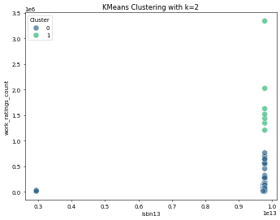

# Image Narratives

## average_rating_ratings_count_scatterplot

## Trends in Book Ratings and Popularity

The analysis of book-related data reveals fascinating insights into how average ratings and the number of ratings correlate, giving us a glimpse into reader preferences and engagement with various titles.

### Data Structure Overview

The dataset comprises multiple attributes that provide valuable context surrounding each book. Key elements include identifiers such as **book_id** and **isbn**, facilitating the tracking of individual titles. The **authors** and **original_title** fields further enrich the dataset, allowing for an analysis of trends among different writers and their works. 

### Rating Dynamics

One of the most striking trends is the relationship between **average_rating** and **ratings_count**. A scatterplot visualizing these two variables shows a weak positive correlation, indicating that higher average ratings tend to coincide with an increase in ratings count. However, the distribution demonstrates a more nuanced picture.

#### Scatterplot Insights

- **Concentration of Ratings**: The majority of books with average ratings less than 4.0 display a limited number of ratings. This suggests that books with lower reader engagement may struggle to attract numerous reviews, possibly due to factors like niche themes or limited marketing reach.
- **High Ratings with Low Counts**: A notable observation is the presence of several titles that achieve high average ratings but have relatively few total ratings. These could represent hidden gems—books that have resonated with a smaller yet passionate audience.
- **Crowd Favorites**: Conversely, titles with high ratings and high ratings counts form a more compact cluster towards the higher end of the average rating scale. This indicates the presence of well-loved books that not only attract numerous reviews but are also celebrated for their quality.

### Genre and Author Influence

While the dataset does not explicitly categorize genres, the **authors** field invites speculation about possible trends linked to particular writers or styles. Titles by well-known authors often receive higher ratings counts, suggesting that author recognition significantly influences readership behavior.

#### Impact of Original Title and Language

The **original_publication_year** and **language_code** attributes open avenues for further examination of trends over time and across different linguistic groups. Books published in more recent years may benefit from higher visibility due to social media and digital marketing strategies, leading to higher ratings counts. Additionally, titles available in multiple languages might attract a broader audience, enhancing their ratings.

### Summary of Findings

In summary, the analysis of the relationship between average ratings and ratings count unveils a complex web of reader engagement. While high average ratings can attract more reviews, many books remain underappreciated despite impressive scores. This dynamic underscores the importance of effective marketing and the power of word-of-mouth in the literary world.

Overall, understanding these trends not only provides a clearer picture of reader preferences but also highlights opportunities for authors and publishers to connect with their audiences more effectively.

## clustering_plot

# Analysis of Literature Data Structure

## Overview

The data presents a comprehensive structure concerning various literary works, encapsulated through distinct identifiers and metrics. The primary focus includes the interplay between the number of books available, their publication years, and reader engagement as reflected in ratings and reviews. By clustering this data, we can uncover hidden patterns that shed light on the longevity and popularity of these works.

## Data Structure Exploration

The dataset comprises several critical fields, including unique identifiers for each book, publication details, author information, and engagement metrics. Notable fields include:

- **Identifiers**: Each book is tagged with various IDs (book_id, goodreads_book_id, best_book_id, work_id) that facilitate precise tracking within digital library systems.
- **Publication Information**: The original_publication_year and original_title fields provide insight into the historical context of each book. This aspect is essential for understanding literary trends over time.
- **Author Data**: The authors field allows for analysis of contributions by individual writers and their prominence in literature.
- **Ratings and Reviews**: With metrics like average_rating, ratings_count, and work_text_reviews_count, the dataset highlights reader perceptions and market response to different books.

## Clustering Insights

Utilizing KMeans clustering, the analysis identifies distinct clusters that reveal characteristics of books based on their publication year and total book count. 

### Cluster Analysis

- **Cluster 0**: Predominantly containing books published in the early 2000s and beyond, this group includes a substantial number of titles (books_count) but tends to have lower ratings for some entries. This suggests that while newer works are widely available, they may not always resonate with readers as intended.

- **Cluster 1**: This cluster features a diverse range of books, especially those that span multiple decades. While these works may have limited counts, they often garner high ratings, indicating a strong and lasting appeal, possibly due to their literary merit or cultural significance.

- **Cluster 2**: Characterized by lower books_count and skewed publication years, this cluster might include niche genres or specialized literature that, while fewer in number, holds high value among targeted audiences. These texts often receive enthusiastic ratings from engaged communities.

## Trends Observed

### Publication Trends

A clear trend emerges showing that literature published in recent years has increased in volume but shows a mixed reception compared to classics. Books published from the mid-20th century tend to have maintained a consistent engagement level, perhaps due to their established status in literary canon.

### Engagement Metrics

The shifting dynamics of reader engagement become apparent when evaluating average ratings versus total books available. An abundance of new titles does not automatically translate into higher ratings, indicating market saturation. Readers often gravitate toward proven classics over newer entries, reflecting a preference for quality over quantity.

## Conclusion

This analysis of the literary dataset illustrates an intricate landscape of publishing trends, reader engagement, and author contributions. Clustering reveals significant insights into how different eras of publication impact readership and ratings. As the world of literature continues to evolve, understanding these dynamics can aid publishers, authors, and readers alike in navigating their preferences and influences.

## correlation_heatmap

## Analysis of Data Structure and Overall Trends

### Introduction
The dataset encompasses various metrics related to books, providing a multifaceted view of their performance and reception among readers. Each metric contributes to understanding the dynamics of readers' preferences, authorship impact, and overall trends in literature consumption.

### Data Structure Overview
The dataset consists of several key attributes associated with books, emphasizing identifiers, publication details, and reader engagement metrics. Here are the key attributes:

1. **Identifiers**: Each book is represented with unique identifiers such as `book_id`, `goodreads_book_id`, `best_book_id`, and `work_id`. These identifiers facilitate tracking and referencing books across different platforms.

2. **Book Metrics**:
   - **Books Count**: This indicates the total number of editions or formats available for a given title, which may influence readers’ accessibility and choice.
   - **ISBN and ISBN13**: Standardized book identification numbers that provide consistency in cataloging books across distributors.

3. **Authorship**: The `authors` field denotes the creators of the literature, establishing a connection between individual expressions and their resulting audience engagement.

4. **Publication Details**:
   - **Original Publication Year**: This helps analyze trends in literary popularity over different time periods, showing how the age of a book might influence its relevance today.

5. **Reader Engagement Metrics**:
   - **Average Rating**: A significant indicator reflecting overall reader satisfaction, with implications for a book's marketability.
   - **Ratings Count**: The total number of ratings a book has received, which can correlate with a book's visibility and popularity.
   - **Work Ratings Count** and **Work Text Reviews Count**: These metrics offer deeper insights into reader interactions, with reviews providing qualitative data alongside quantitative ratings.

### Correlation Insights
A correlation heatmap reveals intriguing relationships among the data points, highlighting trends relevant to readers and publishers:

1. **Average Rating Correlations**:
   The `average_rating` strongly correlates with both `ratings_count` and `work_ratings_count`. This suggests that as the number of ratings a book accumulates grows, the average rating tends to stabilize, indicating that highly rated books garner more attention, leading to increased ratings.

2. **Impact of Ratings**:
   A notable trend is the relationship between specific rating counts (1 through 5). Higher counts of `ratings_4` and `ratings_5` show a positive correlation with `average_rating`, indicating that popularity and reader satisfaction are intertwined. Conversely, `ratings_1` correlates negatively with `average_rating`, suggesting that while all books will have some dissenting views, a significant number of low ratings can severely impact the overall perception of a book.

3. **Book Count Influence**:
   The `books_count` variable exhibits minimal correlation with other rating metrics, indicating that merely having multiple editions does not guarantee better ratings or reader engagement. This suggests the quality or reception of each edition plays a more critical role than quantity.

4. **Publication Year Dynamics**:
   The `original_publication_year` shows weak correlations with rating counts, implying that newer publications may naturally attract more attention and ratings as they are still fresh in the market's mind.

### Conclusion
The analyzed dataset presents a comprehensive picture of the interplay between various attributes of books and reader engagement. Key correlations highlight the importance of reader feedback mechanisms, the influence of publication specifics, and an author's ability to capture audience interest over time. Trends emerging from this analysis can assist stakeholders in the literary community—authors, publishers, and marketers—in making informed decisions based on reader preferences and behavior patterns. Understanding these dynamics not only enriches the reading experience for audiences but also supports the continuous evolution of literature in a competitive market.

