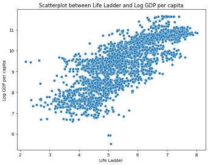

# Image Narratives

## clustering_plot

### Analyzing Global Well-being: A KMeans Clustering Perspective

#### Overview of the Data Structure

The dataset analyzed encompasses a comprehensive array of factors contributing to the well-being of countries around the world. It includes variables such as the Life Ladder score, which reflects perceived life satisfaction; Log GDP per capita, representing economic output; Social support, indicating the availability of social networks; Healthy life expectancy at birth; Freedom to make life choices; Generosity, concerning charitable behavior; Perceptions of corruption; Positive affect, reflecting the presence of positive emotions; and Negative affect, encompassing negative emotions.

This multidimensional dataset provides a rich foundation for understanding the complexities of happiness and well-being across different nations. Each variable offers insights into the interplay between economic, social, and psychological phenomena that influence quality of life.

#### Clustering Insights

Employing KMeans clustering, which partitions the data into distinct groups based on similarity, reveals significant trends within the various factors contributing to national well-being. The analysis resulted in three identifiable clusters that categorize countries based on their Life Ladder and Log GDP per capita scores.

1. **Cluster 0**: Characterized by higher Log GDP per capita (around 10-11) and varying Life Ladder scores, this cluster consists predominantly of affluent nations where economic prosperity accommodates higher life satisfaction levels. Countries in this group typically report high social support and low perceptions of corruption, contributing to overall positive emotional experiences. Most nations here enjoy healthy life expectancies, reinforcing the link between economic strength and well-being.

2. **Cluster 1**: This group presents a middle ground where countries demonstrate moderate economic performance (Log GDP ranging from 8-10) combined with moderate Life Ladder ratings (around 4-6). Countries in this cluster are often transitioning economies that exhibit growth but grapple with issues such as corruption and lower social support, leading to mixed emotional outcomes. Generosity levels may vary, as the social fabric could be under strain from economic pressures.

3. **Cluster 2**: Encompassing a lower economic performance spectrum, this cluster is marked by lower Life Ladder scores (2-4) alongside Log GDP per capita scores mainly below 9. It suggests a demographic facing significant challenges, possibly including high perceptions of corruption and low social support. Citizens in these countries may experience heightened levels of negative affect, illustrating the psychological toll of economic hardship and social instability.

#### Trends and Concluding Observations

The analysis underscores the profound relationship between economic factors and perceived well-being. As indicated by the visual separation in the clusters, countries with higher economic indicators typically report greater life satisfaction, underscored by robust social support systems. Contrarily, nations with lower economic performance face challenges that significantly impact their citizens' happiness and emotional wellness.

The insights drawn from clustering highlight that economic development alone does not automatically confer happiness. It must be complemented by strong social structures, freedom in personal choices, and low corruption rates. For policymakers, this underscores the importance of a holistic approach that addresses both economic and social dimensions to enhance overall well-being.

In summary, the exploration of these trends reveals that global well-being is a multifaceted issue, deeply intertwined with economic prosperity, social networks, individual freedoms, and the overarching influence of governance. Effective interventions should aim to foster not just economic growth, but also to cultivate environments where citizens can thrive emotionally and socially.

## correlation_heatmap

## Analysis of Well-Being Indicators Across Countries

### Overview 

This report delves into the intricate relationships among various well-being indicators across different countries. The analysis provides insights into how these factors correlate with one another and collectively contribute to the perceived quality of life within these nations.

### Key Indicators

1. **Life Ladder**: This indicator reflects subjective well-being as rated by individuals, representing how people perceive their overall life satisfaction.

2. **Log GDP per Capita**: This economic metric gauges the overall wealth of a nation, adjusted for population, highlighting the economic conditions that may influence well-being.

3. **Social Support**: The degree to which individuals perceive they have support from their communities, indicating social safety nets and connections.

4. **Healthy Life Expectancy at Birth**: This public health measure assesses the number of years a newborn can expect to live in good health, reflecting overall health conditions and healthcare quality.

5. **Freedom to Make Life Choices**: This measure evaluates the level of autonomy individuals feel they have in making choices about their lives.

6. **Generosity**: This indicator assesses the extent to which individuals contribute to social and charitable initiatives, reflecting community cohesion and altruism.

7. **Perceptions of Corruption**: This metric gauges the public perception of corruption in governmental and business institutions, impacting trust and stability.

8. **Positive and Negative Affect**: These indicators reflect emotional well-being, illustrating the balance of positive emotions against negative experiences within a population.

### Correlation Insights

#### Strong Correlations

1. **Life Ladder and Log GDP per Capita**: There is a robust positive correlation (0.78) between the Life Ladder and Log GDP per Capita. This suggests that as countries experience higher GDP per capita, the perceived quality of life or life satisfaction tends to increase, indicating economic prosperity plays a significant role in happiness.

2. **Social Support and Life Ladder**: A substantial correlation (0.64) exists between social support and the Life Ladder. This highlights the importance of community bonds and support networks in determining overall happiness.

3. **Healthy Life Expectancy at Birth and Life Ladder**: The observations show a notable correlation (0.60), emphasizing that health outcomes directly impact individuals' life satisfaction.

#### Moderate Correlations

1. **Freedom to Make Life Choices and Life Ladder**: There is a moderate correlation (0.54), indicating that greater autonomy in life decisions contributes positively to well-being, suggesting that personal freedom is a crucial component of happiness.

2. **Perceptions of Corruption and Life Ladder**: A moderate negative correlation (-0.42) between perceptions of corruption and the Life Ladder indicates that higher corruption levels correlate with lower life satisfaction, affecting citizens' trust in social and governmental systems.

#### Weak Correlations

1. **Generosity and Life Ladder**: A weak positive correlation (0.31) suggests a less direct impact of altruistic behaviors on individual well-being, hinting that while generosity is valuable, it might not be a dominant factor in life satisfaction.

2. **Negative Affect and Life Ladder**: This correlation (-0.33) shows an inverse relationship, where increased feelings of negative affect lead to lower life satisfaction, affirming the expected emotional influences on well-being.

### Additional Observations

- **Social Support's Role**: Social support not only correlates strongly with life satisfaction but also shows significant interactions with other variables like healthy life expectancy and perceptions of corruption, indicating it may serve as a foundational element influencing multiple aspects of well-being.

- **Generosity's Limited Impact**: While generosity is commendable, its effects on perceived happiness appear limited compared to economic factors and social support systems.

- **Overall Emotional Landscape**: The balance of positive and negative affects illustrates a nuanced landscape of wellbeing where emotional health plays a critical role in overall life satisfaction.

### Conclusion

The analysis of these well-being indicators underscores the intricate web of relationships that shape life satisfaction in various countries. Economic prosperity, social support, and health emerge as pivotal components that influence individual happiness. Understanding these correlations can guide policymakers in implementing strategies to enhance quality of life and foster well-being at both community and national levels.

## Life_Ladder_Log_GDP_per_capita_scatterplot

### Analyzing the Correlation Between Life Ladder and Economic Indicators

In examining the relationship between various social and economic indicators across countries, a prominent correlation emerges between the Life Ladder and Log GDP per capita. This analysis draws from a comprehensive data set that encapsulates multiple indicators, highlighting the intertwined nature of well-being and economic stability.

#### Life Ladder and Economic Prosperity

The Life Ladder, a measure of subjective well-being, reflects how individuals perceive their quality of life on a scale from 0 to 10. The scatterplot indicates a clear trend wherein higher Life Ladder scores correspond to increased Log GDP per capita. This trend suggests that as individuals' perceived life satisfaction rises, so does the economic prosperity of their country.

The Log GDP per capita serves as a proxy for economic performance, transforming raw income data into a scale that more accurately reflects comparative economic well-being. The scatterplot’s dense clustering of points along an upward slope underscores this positive correlation, reinforcing the concept that economic conditions significantly influence personal satisfaction.

#### Social Support and Healthy Life Expectancy

Beyond economic factors, the data reveals insights into social support systems and their effects on life satisfaction. Countries with higher levels of social support tend to report greater Life Ladder scores. This trend highlights the essential role of community and institutional support in fostering a sense of belonging and well-being among individuals.

Moreover, Healthy Life Expectancy at birth is another critical variable that plays a role in determining Life Ladder scores. Healthier populations typically experience higher life satisfaction, as good health directly influences individuals’ quality of life, allowing them to engage fully in daily activities and pursue their aspirations.

#### Freedom and Generosity

Another significant aspect is the freedom to make life choices. The data suggests that countries offering greater personal freedoms tend to align with higher Life Ladder scores, indicating that autonomy contributes fundamentally to happiness. This relationship emphasizes the importance of societal structures that promote individual rights and decision-making power.

Generosity, measured through charitable behaviors and attitudes, also appears to correlate with higher Life Ladder scores. There is a compelling narrative that societies wherein individuals engage in altruistic actions foster a more cohesive atmosphere, further enhancing overall happiness and life satisfaction.

#### Perceptions of Corruption

Conversely, perceptions of corruption are inversely related to Life Ladder scores. Nations perceived as having higher corruption levels correspond to lower life satisfaction. This observation points to the detrimental effects of corruption on societal morale and trust, which can ultimately degrade quality of life.

#### Emotional Well-Being

The dimensions of positive and negative affect also provide crucial context to the analysis. Countries that exhibit higher positive affect—feelings of joy and fulfillment—show stronger Life Ladder responses. In contrast, high levels of negative affect correlate with diminished life satisfaction, demonstrating the complex interplay between emotional experiences and subjective well-being.

### Conclusion

The exploration of this data reveals a multifaceted relationship between life satisfaction and various economic and social factors. The moderate to strong correlations identified suggest that improving economic conditions, enhancing social support, fostering freedoms, and cultivating a culture of generosity can significantly influence individual well-being. Likewise, minimizing corruption and promoting positive emotional experiences are essential to cultivating a holistic sense of satisfaction in life. These insights can guide policymakers in strategically targeting interventions to enhance the quality of life across diverse populations, ensuring that economic and social development go hand in hand.

