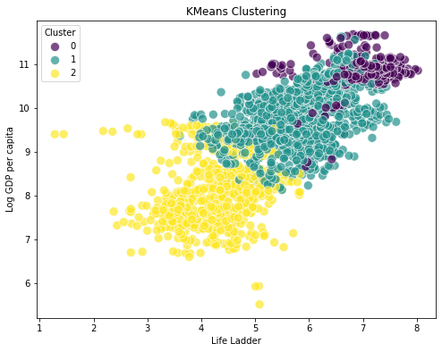
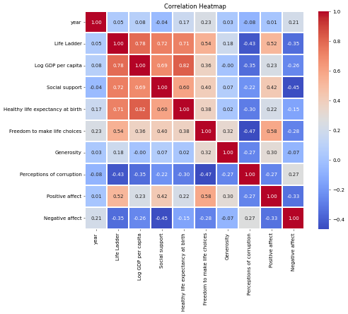
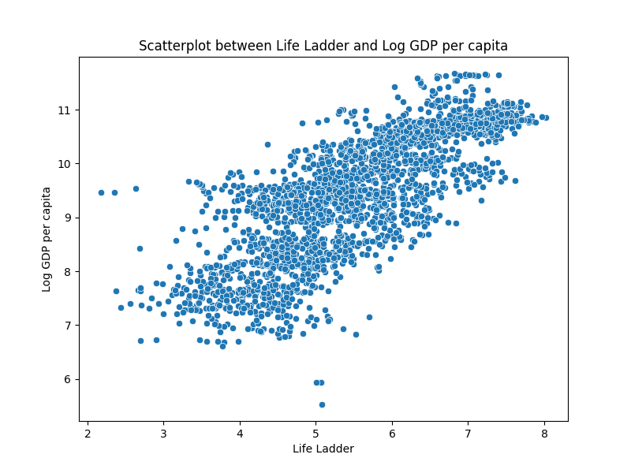

# Image Narratives

## clustering_plot

# Report on Global Well-being: Insights from KMeans Clustering Analysis

## Introduction

This report delves into the factors influencing global happiness and societal well-being as derived from a clustering analysis of various countries. Using a dataset that includes metrics such as the Life Ladder, GDP per capita, social support, and perceptions of corruption, we aim to identify patterns and insights that highlight the interrelationships between these factors and their impact on the quality of life in different nations.

## Data Overview

The dataset consists of empirical data collected across various countries, reflecting the year’s metrics on well-being. The key headers in our dataset include:

- **Country Name**
- **Year**
- **Life Ladder**: A subjective measure of well-being, ranging from 1 to 10.
- **Log GDP per Capita**: The logarithm of the Gross Domestic Product per capita, indicating economic performance.
- **Social Support**: Numerical representation of the perceived availability of support in times of need.
- **Healthy Life Expectancy at Birth**: Average years of healthy life expected at birth.
- **Freedom to Make Life Choices**: A measure of autonomy in decision-making.
- **Generosity**: A score reflecting the willingness to help others financially.
- **Perceptions of Corruption**: A measure of how corrupt individuals in society consider their government and business leaders.
- **Positive Affect**: A composite score indicating the prevalence of positive feelings.
- **Negative Affect**: A composite score indicating the prevalence of negative feelings.

## KMeans Clustering Analysis

The KMeans clustering method was applied to categorize countries based on the selected metrics. The resulting clusters revealed distinct groupings that elucidate the correlation between economic performance (Log GDP per capita) and subjective well-being (Life Ladder).

### Cluster Visuals

The scatter plot illustrates three major clusters:

1. **Cluster 0 (Purple)**: Typically represents countries with high GDP per capita and high life satisfaction. These nations often have robust economies, effective governance, and comprehensive social support systems.

2. **Cluster 1 (Teal)**: This cluster shows countries with moderate GDP and life satisfaction. Nations in this group may struggle with economic disparities but exhibit sufficient social support and freedom of choice, contributing to a balanced sense of well-being.

3. **Cluster 2 (Yellow)**: Reflecting countries with lower economic output and life satisfaction, this cluster highlights the challenges faced by many developing nations grappling with issues such as limited social support, high perceptions of corruption, and low health outcomes.

### Key Observations from Sample Data

To illustrate these trends, consider the following sample entries:

- **Malaysia (2006)**: With a Life Ladder score of 6.012 and a Log GDP per capita of 9.827, Malaysia falls into Cluster 1. It shows a balance in social support and positive affect despite a modest perception of corruption.

- **Armenia (2010)**: Armenia, with a Life Ladder of 4.368, reflects the struggles faced by nations with lower economic standing (Log GDP per capita of 9.113). Here, the data indicates lower social support and higher negative affect.

- **Montenegro (2022)**: Montenegro’s Life Ladder score of 5.600 and a Log GDP of 10.002 place it in Cluster 1, indicating a moderate level of life satisfaction supported by reasonable social structures.

- **Tanzania (2023)**: With a Life Ladder of 4.042 and Log GDP per capita of 7.893, Tanzania exemplifies Cluster 2 challenges, signifying significant social and economic hurdles that impact overall well-being.

- **United Kingdom (2013)**: Displaying a Life Ladder score of 6.918 and high Log GDP of 10.668, the UK reveals the benefits of effective governance and economic stability found in Cluster 0.

## Conclusion

The KMeans clustering analysis sheds light on the intricate relationship between economic performance and quality of life indicators. While nations with higher GDPs generally correlate with greater life satisfaction and social support, the global landscape is complex. Efforts must focus on bridging the gaps for countries falling into the lower clusters, ensuring sustainable development, enhancing governance, and fostering social cohesion. Through continued research and targeted policy interventions, improvements in global well-being can be achieved.

## correlation_heatmap

# Exploring Global Well-Being: A Comprehensive Report

## Introduction
In an increasingly interconnected world, understanding the factors that contribute to individual and societal well-being is paramount. This report delves into a diverse dataset comprising several countries, examining various metrics such as the Life Ladder, Log GDP per capita, Social Support, Healthy Life Expectancy, and perceptions of freedom and corruption. Through a detailed analysis, we aim to provide insights into how these parameters interact and contribute to the overall happiness and quality of life in different regions.

## Country Profiles

### Malaysia (2006)
- **Life Ladder**: 6.012
- **Log GDP per capita**: 9.827
- **Social Support**: 0.866
- **Healthy Life Expectancy**: 65.08
- **Freedom to Make Life Choices**: 0.837
- **Generosity**: 0.196
- **Perceptions of Corruption**: 0.740
- **Positive Affect**: 0.687
- **Negative Affect**: 0.243

In 2006, Malaysia exhibited a robust economic profile, highlighted by a high GDP per capita. The relatively high Life Ladder score indicates a positive assessment of personal well-being among its citizens, underpinned by substantial social support. However, perceptions of corruption remain a concern, suggesting areas for governance improvement.

### Armenia (2010)
- **Life Ladder**: 4.368
- **Log GDP per capita**: 9.113
- **Social Support**: 0.660
- **Healthy Life Expectancy**: 64.80
- **Freedom to Make Life Choices**: 0.459
- **Generosity**: -0.180
- **Perceptions of Corruption**: 0.891
- **Positive Affect**: 0.437
- **Negative Affect**: 0.426

Armenia's situation in 2010 paints a different picture. A lower Life Ladder score reflects significant challenges in personal well-being, compounded by limited freedom to make life choices. The high perception of corruption suggests a lack of trust in institutions, which could contribute to citizens' negative emotional states.

### Montenegro (2022)
- **Life Ladder**: 5.600
- **Log GDP per capita**: 10.002
- **Social Support**: 0.875
- **Healthy Life Expectancy**: 67.30
- **Freedom to Make Life Choices**: 0.778
- **Generosity**: -0.022
- **Perceptions of Corruption**: 0.802
- **Positive Affect**: 0.485
- **Negative Affect**: 0.317

By 2022, Montenegro has made strides in improving well-being metrics, indicated by a higher Life Ladder score and increased life expectancy. The data suggests that while social support remains strong, perceptions of corruption continue to challenge the nation’s progress toward enhancing personal freedoms and overall happiness.

### Tanzania (2023)
- **Life Ladder**: 4.042
- **Log GDP per capita**: 7.893
- **Social Support**: 0.663
- **Healthy Life Expectancy**: 60.30
- **Freedom to Make Life Choices**: 0.862
- **Generosity**: 0.122
- **Perceptions of Corruption**: 0.609
- **Positive Affect**: 0.609
- **Negative Affect**: 0.210

Tanzania's status in 2023 reveals stark contrasts in well-being. While the freedom to make life choices is notably high, the Life Ladder score is low, suggesting significant room for improvement in personal and societal well-being. Nonetheless, the positive affect measure indicates resilient optimism among citizens.

### United Kingdom (2013)
- **Life Ladder**: 6.918
- **Log GDP per capita**: 10.668
- **Social Support**: 0.937
- **Healthy Life Expectancy**: 69.58
- **Freedom to Make Life Choices**: 0.905
- **Generosity**: 0.341
- **Perceptions of Corruption**: 0.568
- **Positive Affect**: 0.719
- **Negative Affect**: 0.252

Finally, the United Kingdom in 2013 showcases some of the highest scores across all metrics, illustrating a robust framework for individual fulfillment and health. The combination of high life expectancy, social support, and freedom to make choices reflects a favorable landscape for well-being, though perceptions of corruption indicate that trust remains an area for attention.

## Data Analysis: Correlation Insights

The correlation heatmap reveals intriguing relationships among key metrics. For instance, the Life Ladder is most strongly correlated with Social Support (0.72) and Healthy Life Expectancy (0.71), suggesting that communities with robust social networks tend to foster higher levels of well-being. Furthermore, greater Freedom to Make Life Choices demonstrates a moderate correlation with the Life Ladder (0.54), emphasizing the importance of autonomy in enhancing life satisfaction.

While Generosity exhibited weak correlations with other metrics, it raises questions about its role in fostering community well-being. Notably, perceptions of corruption appear negatively correlated with most positive metrics, indicating that improving governance may bolster not only social trust but also overall life satisfaction.

## Conclusion
This report underscores the multifaceted nature of global well-being, revealing significant disparities across countries. It illustrates the importance of economic factors, social structures, and governance in shaping individuals’ experiences. As nations strive to improve well-being, insights derived from data can inform policies aimed at enhancing happiness and quality of life. By focusing on fostering social support, health, and freedom, governments can facilitate more significant advancements toward a fulfilling societal existence.

## Life Ladder_Log GDP per capita_scatterplot

# The Interconnection of Happiness and Economic Prosperity: A Dive into Global Data

## Introduction

In an increasingly interconnected world, the relationship between economic prosperity and individual well-being has garnered significant attention. This report explores data from various countries, juxtaposing economic metrics such as Gross Domestic Product (GDP) per capita against measures of life satisfaction, or the "Life Ladder." Through an analysis of sample data and visual representation, we can unravel the complexities of happiness and economic conditions across different cultures and nations.

## The Data Landscape

The dataset spans various countries, years, and key indices that gauge the quality of life and perceptions of well-being. The primary measures include:

- **Life Ladder**: This metric reflects subjective well-being, indicating how individuals rate their lives on a scale from 0 to 10.
- **Log GDP per capita**: A logarithmic transformation of income data, providing insight into the economic health of a nation.
- Additional indicators such as social support, life expectancy, freedom to make choices, generosity, perceptions of corruption, positive affect, and negative affect offer a multifaceted view of happiness.

### Sample Data Overview

1. **Malaysia (2006)**: 
   - Life Ladder: 6.012
   - Log GDP per capita: 9.827
   - Social support: 0.866
   - Healthy life expectancy: 65.08
   
2. **Armenia (2010)**: 
   - Life Ladder: 4.368
   - Log GDP per capita: 9.113
   - Social support: 0.660
   - Healthy life expectancy: 64.80
  
3. **Montenegro (2022)**: 
   - Life Ladder: 5.600
   - Log GDP per capita: 10.002
   - Social support: 0.875
   - Healthy life expectancy: 67.30

4. **Tanzania (2023)**: 
   - Life Ladder: 4.042
   - Log GDP per capita: 7.893
   - Social support: 0.663
   - Healthy life expectancy: 60.30

5. **United Kingdom (2013)**: 
   - Life Ladder: 6.918
   - Log GDP per capita: 10.668
   - Social support: 0.937
   - Healthy life expectancy: 69.58

## Visual Analysis: Scatterplot Insights

The scatterplot provides a clear relationship between the Life Ladder and Log GDP per capita. The upward trend observed suggests that higher GDP per capita is generally associated with increased life satisfaction. This correlation can be attributed to several factors:

1. **Economic Stability**: Countries with higher GDP tend to have better infrastructure, healthcare, and educational systems, all contributing to quality of life.
  
2. **Social Support Systems**: Economically prosperous countries often invest more in social safety nets, enabling citizens to feel secure and supported.

3. **Freedom and Opportunities**: Increased economic resources typically translate to greater freedom in personal choices, leading to enhanced life satisfaction.

## Case Studies

### Malaysia vs. Tanzania

Examining Malaysia and Tanzania illustrates divergent paths of development. Malaysia, with a Life Ladder score of 6.012 and a Log GDP per capita of 9.827, reflects a relatively high level of satisfaction linked to its economic progress. In contrast, Tanzania's lower Life Ladder of 4.042 paired with a Log GDP of 7.893 indicates that despite social supports in place, economic limitations are affecting overall happiness.

### United Kingdom's Benchmarks

The United Kingdom exemplifies a high-income nation with a Life Ladder of 6.918 and the highest Log GDP per capita in the sample at 10.668. The robust social infrastructure and low perceptions of corruption contribute to positive affect and a lower ratio of negative affect among its citizens.

## Conclusion

The interplay between economic prosperity and individual well-being is complex yet revealing. Nations across the globe exhibit varied levels of life satisfaction correlating with their economic metrics, underscoring the importance of holistic development strategies that encompass not only economic growth but also social support and individual freedoms. 

As we continue to analyze global trends, this report highlights a crucial narrative: sustainable and equitable economic growth is pivotal for enhancing life satisfaction worldwide. Future initiatives aimed at bridging the gap between economic disparities and subjective well-being will be essential in crafting a happier, more fulfilled global society.

