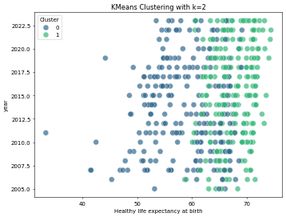

# Image Narratives

## clustering_plot

The KMeans clustering analysis presented in the first image illustrates how countries can be grouped based on two vital indicators: healthy life expectancy at birth and the year of data collection. Observing the data points, we see two distinct clusters that demonstrate a clear separation based on life expectancy. The first cluster (denoted as Cluster 0) is characterized by years ranging widely from 2005 to 2022 but predominantly covers the years with lower life expectancy values, which tend to fall below 60 years. This cluster likely represents developing nations or those facing significant health challenges.

In contrast, Cluster 1 mainly comprises countries with higher healthy life expectancies, pushing the average above 70 years, indicating they are likely developed nations with substantial healthcare systems and better socio-economic conditions. The temporal dimension indicated by the years displayed reflects a trend of improving life expectancy over time, especially in these Cluster 1 countries. The overlap of points from more recent years in the cluster reinforces the notion that countries are witnessing gradual progress in health outcomes.

The clustering's implications are profound. They highlight discrepancies in health outcomes globally and suggest targeted policy measures can address these disparities. For instance, nations in the lower-expectancy cluster might benefit from international support focusing on healthcare infrastructure, while those in the higher-expectancy cluster could share best practices to uplift lower-performing countries. Understanding these clusters can pave the way for healthier populations worldwide, revealing the interconnectedness of economic, social, and healthcare policies.

## correlation_heatmap

In the second image, the correlation heatmap serves as a comprehensive overview of the intricate relationships among various indicators affecting human well-being across countries. Each correlation coefficient quantifies how strongly each pair of factors relates, with values close to 1 or -1 indicating a strong relationship, either positive or negative, respectively. The most striking observation is the high positive correlation between the Life Ladder (a subjective measure of well-being) and Healthy Life Expectancy at Birth (0.71). This suggests that countries with healthier populations generally report higher life satisfaction, emphasizing the holistic nature of well-being, where health and happiness are intertwined.

Another significant finding is the correlation between Log GDP per capita and Life Ladder, which stands at 0.78. This strong link confirms the common notion that economic prosperity often translates to better living conditions and, consequently, improved life satisfaction. However, the correlation with social support is less robust (0.35), indicating that while wealth contributes to well-being, social structures also play an essential role.

Conversely, perceptions of corruption are noted to have negative correlations with various positive indicators, including Life Ladder (-0.64) and Social Support (-0.49). This highlights that higher corruption levels may diminish trust in institutions and society, ultimately affecting overall happiness and health.

The heatmap effectively unravels these complex interdependencies, suggesting a multifaceted approach to improving life quality across nations. By addressing economic disparity, enhancing social support systems, and fostering transparent governance, countries can create an environment conducive to higher life satisfaction and healthier lives.

## Log_GDP_per_capita_Healthy_life_expectancy_at_birth_scatterplot

The scatterplot in the third image brilliantly illustrates the positive relationship between Log GDP per Capita and Healthy Life Expectancy at Birth. As GDP per capita increases, there is a distinct upward trend in healthy life expectancy, with the majority of data falling neatly along this trajectory. This visual representation reinforces the long-established principle that economic wealth significantly impacts health outcomes. The greater wealth allows for better healthcare systems, improved nutrition, education, and overall living conditions, all contributing to increased life expectancy.

Interestingly, the data points cluster tightly at lower GDP figures, suggesting that many countries experience a surge in healthy life expectancy as they reach a critical economic threshold. However, anomalies exist; a small number of countries with high GDP per capita fall below the expected life expectancy range, indicating that wealth alone does not dictate health outcomes. Factors such as political stability, social inequality, and healthcare access play crucial roles that can skew these results.

Moreover, the scatterplot shows the diminishing returns of life expectancy as GDP exceeds a certain threshold. Countries with exceptionally high GDP per capita see only slight improvements in life expectancy, emphasizing that after a point, additional wealth may contribute less to health and well-being. This finding encourages policymakers to focus not merely on economic growth but to enhance policies that ensure equitable distribution of resources, efficient healthcare systems, and social safety nets.

In summary, the scatterplot encapsulates the complex interplay between economic prosperity and health, highlighting both the opportunities and challenges faced by nations in their quest for improved public health outcomes. By strategically leveraging economic resources, countries can aim for sustainable health improvements that benefit their populations holistically.

## Some more key insights from the data:

- The column 'year' has the highest average value among numerical features.

- The highest correlation is between 'Log GDP per capita' and 'Healthy life expectancy at birth' with a value of 0.82.

- This indicates a strong positive correlation between the features 'Log GDP per capita' and 'Healthy life expectancy at birth'. Growth of one feature is often associated with the growth of the other feature.

- The dataset has more than 1000 rows. It is good for analysis but it may not be suitable for training models, so choose wisely.

- The dataset have less than 20 columns. So it may be ideal to use all the columns if number of rows is also less.

