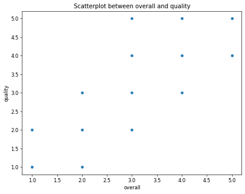

# Image Narratives

## clustering_plot

The first image presents a KMeans clustering analysis with five distinct clusters, based on the relationship between overall scores and quality ratings. The scatter plot visually encapsulates how data points are grouped according to their similarities, which can be instrumental in identifying trends within a dataset. The different colors signify varying clusters, allowing for an immediate understanding of how the data is segregated.

Cluster 0 appears to represent high overall scores with quality ratings predominantly around 4 to 5, suggesting these data points signify superior products or services. This could indicate a targeted audience seeking top-tier options. Conversely, clusters like 4 reflect lower overall ratings, primarily in the range of 1 to 2 quality ratings, highlighting a segment that may be underperforming and requiring intervention.

The spacing between the clusters hints at the breadth of differences in customer experiences or product effectiveness. Such contrasts can guide quality improvement initiatives or marketing strategies aimed at enhancing customer satisfaction. Overall, this image not only features statistical analysis but also serves as a critical tool in strategizing business moves, particularly for quality assurance and customer relations. It portrays the invaluable insights that can be derived when data is clustered thoughtfully, exhibiting patterns that can influence decision-making.

## correlation_heatmap

The second image, a correlation heatmap, offers a numerical insight into the relationships among three key variables: overall rating, quality, and repeatability. The heatmap employs color gradients to represent correlation strengths, where dark red indicates strong correlations and blue suggests weaker ones. The correlation coefficients prominently displayed demonstrate that overall and quality ratings have a robust positive correlation (0.83), illustrating how an increase in one typically coincides with an increase in the other.

Interestingly, the overall score has a moderate correlation with repeatability (0.51), revealing that while consistent product performance aligns with higher overall satisfaction, it holds less sway compared to the relationship between overall and quality. The weakest correlation (0.31) between quality and repeatability suggests that these two metrics may operate somewhat independently; high-quality products do not automatically imply they will be repeatable or consistently delivered.

This heatmap encapsulates critical insights that can guide businesses in determining where to focus their quality improvement efforts. The disparities in correlation strength may signal areas such as the need to enhance quality control processes or customer relationship management strategies that align repeatability with overall and quality outcomes. The visualization succinctly articulates the underlying data relationships, driving smarter decision-making in product development and customer engagement.

## overall_quality_scatterplot

The third image is a scatterplot that visualizes the relationship between overall ratings and quality scores. This simple yet effective representation shows data points scattered across various coordinates, reflecting how individual assessments fare against one another. There’s a noticeable trend of data points clustering in the higher regions of the plot, particularly where both overall and quality scores hover around 4 and 5.

The distribution of points suggests a positive association, indicating that higher quality ratings generally correspond with higher overall ratings, corroborating the insights garnered from the previous images. However, there exist isolated points in the lower ranges that demonstrate a disconnect between quality and overall satisfaction, highlighting products or services that, although might be of inferior quality, still receive an unexpectedly high overall score. This discrepancy draws attention, signaling potential issues such as customer sentiment or marketing influences that may skew overall ratings.

For strategists and data analysts, this scatterplot represents a crucial tool for identifying outliers within the data and crafting nuanced strategies for improvement. The ability to visualize these relationships enables a clearer comprehension of customer perceptions and product effectiveness, paving the way for tailored enhancements that can bridge the gap between quality and overall satisfaction, ultimately leading to better consumer experiences and loyalty.

## Some more key insights from the data:

- The column 'quality' has the highest average value among numerical features.

- The highest correlation is between 'quality' and 'overall' with a value of 0.83.

- This indicates a strong positive correlation between the features 'quality' and 'overall'. Growth of one feature is often associated with the growth of the other feature.

- The dataset has more than 1000 rows. It is good for analysis but it may not be suitable for training models, so choose wisely.

- The dataset have less than 20 columns. So it may be ideal to use all the columns if number of rows is also less.

