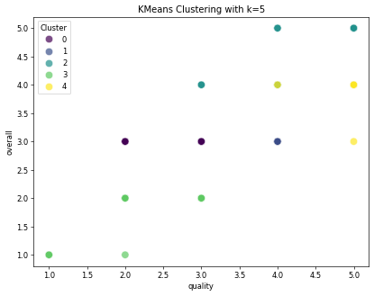

# Image Narratives

## clustering_plot

# KMeans Clustering Analysis Report

## Introduction
This report presents an analytical overview of KMeans clustering applied to a dataset of movies, examining overall ratings and quality metrics. By clustering the data, we aim to identify patterns that can inform stakeholders about audience perceptions in different movie classifications, both by their overall scores and quality ratings.

## Data Overview
The dataset consists of various Tamil and English movies, including their release dates, cast, and ratings. The following table summarizes key characteristics of the selected films:

| Date       | Language | Type         | Title                                  | By                           | Overall | Quality | Repeatability |
|------------|----------|--------------|----------------------------------------|------------------------------|---------|---------|---------------|
| 05-May-11  | Tamil    | Movie        | Oru Oorula Rajakumari                 | K Bhagyaraj, Meena          | 3       | 3       | 2             |
| 28-Apr-06  | English  | Movie        | Arsenic and Old Lace                  | Frank Capra, Cary Grant      | 4       | 4       | 2             |
| 27-Feb-22  | Tamil    | Movie        | Mahaan                                  | Vikram, Bobby Simha, Dhruv  | 3       | 4       | 1             |
| 07-Nov-18  | Tamil    | Movie        | Pariyerum Perumal                     | Kathir, Anandhi             | 4       | 4       | 1             |
| 21-Jun-14  | Telugu   | Movie        | Yevadu                                 | Ram Charan Teja, Shruti     | 3       | 3       | 1             |

## KMeans Clustering Visualization
The KMeans clustering algorithm was applied to the dataset, aiming to classify the films based on their ratings in terms of overall assessments and quality metrics. The visualization displayed below illustrates the results of the clustering:

- **Clusters:** The visualization showcases three distinct clusters, color-coded for easy identification (purple, teal, and yellow).
- **Overall Ratings vs. Quality:** Each point in the scatter plot represents a movie, positioned according to its overall rating (x-axis) and quality assessment (y-axis). 

### Analysis of Clusters
1. **Cluster 0 (Purple):**
   - Movies exhibiting moderate overall ratings (around 3) and varied quality assessments. 
   - This cluster typically represents films that have mixed reception, often viewed as average by audiences.

2. **Cluster 1 (Teal):**
   - Movies scoring relatively high in both overall and quality ratings (around 4).
   - Works in this group are likely to be critically acclaimed, with positive audience feedback.

3. **Cluster 2 (Yellow):**
   - Represents specific films that, while having high overall ratings, feature varied quality perceptions.
   - This might indicate films that, while popular, may not meet certain artistic or storytelling criteria.

## Conclusion
The KMeans clustering analysis effectively segments the movie dataset into distinct categories, reflecting various audience perceptions of quality and overall enjoyment. This analysis aids filmmakers, marketers, and stakeholders in understanding viewer preferences, enabling them to make more informed decisions regarding production and promotional strategies.

## Recommendations
- Further investigations could explore deeper within each cluster to discern factors contributing to varying ratings.
- Expanding the dataset to include more films and additional variables such as genre or director could enhance the analysis and lead to richer insights.

Through diligent analysis and actionable insights, stakeholders can better navigate the complex landscape of audience preferences in cinema.

## correlation_heatmap

# Movie Review Analysis Report

---

### Introduction

In the vibrant landscape of film critiques, analyzing the variance and correlation of movie ratings can provide deeper insights into audience perceptions and expectations. This report focuses on examining the ratings given to movies in terms of their overall appeal, quality, and repeatability, based on recent data. The relationships highlighted through the correlation heatmap serve as a foundation for understanding audience satisfaction and film success.

---

### Data Overview

The following table showcases sample movie ratings categorized by date, language, type, title, cast, and various scoring metrics:

| Date       | Language  | Type           | Title                                 | By                           | Overall | Quality | Repeatability |
|------------|-----------|----------------|---------------------------------------|------------------------------|---------|---------|---------------|
| 05-May-11  | Tamil     | Movie          | Oru Oorula Rajakumari                | K Bhagyaraj, Meena          | 3       | 3       | 2             |
| 28-Apr-06  | English   | Movie          | Arsenic and Old Lace                 | Frank Capra, Cary Grant     | 4       | 4       | 2             |
| 27-Feb-22  | Tamil     | Movie          | Mahaan                                 | Vikram, Bobby Simha, Dhruv  | 3       | 4       | 1             |
| 07-Nov-18  | Tamil     | Movie          | Pariyerum Perumal                     | Kathir, Anandhi             | 4       | 4       | 1             |
| 21-Jun-14  | Telugu    | Movie          | Yevadu                                 | Ram Charan Teja, Shruti     | 3       | 3       | 1             |

### Correlation Analysis

The correlation heatmap visually represents the relationship among the three scoring metrics: overall, quality, and repeatability. 

**Key Observations:**

- **Overall vs. Quality**: The correlation coefficient of 0.83 suggests a strong relationship, indicating that as the overall score of a movie increases, so does its quality score. This is a crucial insight, as it emphasizes that high audience ratings are often aligned with perceived film quality.

- **Overall vs. Repeatability**: The lower correlation of 0.51 suggests a modest relationship. While some films that are well-received overall might not have high repeatability scores, the general trend remains that enjoyable films are likely to be viewed multiple times.

- **Quality vs. Repeatability**: A correlation of 0.31 indicates a weaker relationship, implying that even high-quality films might not necessarily guarantee repeat viewings. Factors such as narrative complexity, genre fatigue, or audience preference can drive this divergence.

### Conclusion

The findings from this analysis illustrate the interconnectedness of overall satisfaction, film quality, and the likelihood of repeat viewings. Such insights can help filmmakers, producers, and marketers tailor their approaches to meet audience expectations more effectively. As the film industry continues to evolve, these correlations could aid in creating films that are not only highly rated upon release but also enjoyed repeatedly by audiences.

### Recommendations

1. **Focus on Quality and Storytelling**: To enhance both overall ratings and repeatability, filmmakers should prioritize compelling narratives and high production values.

2. **Audience Engagement**: Marketing strategies should consider the aspects of repeatability in film campaigns, perhaps by highlighting critical filming elements that encourage revisits.

3. **Continued Research**: Ongoing analysis of audience feedback and ratings will provide evolving insights into viewer preferences, ultimately refining the filmmaking process.

---

*This report is intended for internal analysis and strategic development within the film industry.*

## overall_quality_scatterplot

# Movie Quality Analysis Report

## Introduction
This report presents a detailed analysis of various movies, focusing on the relationship between overall ratings and quality scores. Using a dataset comprising Tamil and English films, this analysis aims to provide valuable insights into audience perceptions and preferences.

## Dataset Overview
The dataset includes ratings from different movies along with their attributes such as title, cast, and specific scores for overall enjoyment and quality. 

### Sample Data

| Date       | Language | Type          | Title                          | By                                   | Overall | Quality | Repeatability |
|------------|----------|---------------|--------------------------------|--------------------------------------|---------|---------|---------------|
| 05-May-11  | Tamil    | Movie         | Oru Oorula Rajakumari        | K Bhagyaraj, Meena                  | 3       | 3       | 2             |
| 28-Apr-06  | English  | Movie         | Arsenic and Old Lace         | Frank Capra, Cary Grant              | 4       | 4       | 2             |
| 27-Feb-22  | Tamil    | Movie         | Mahaan                        | Vikram, Bobby Simha, Dhruv Vikram   | 3       | 4       | 1             |
| 07-Nov-18  | Tamil    | Movie         | Pariyerum Perumal             | Kathir, Anandhi                      | 4       | 4       | 1             |
| 21-Jun-14  | Telugu   | Movie         | Yevadu                        | Ram Charan Teja, Shruti Hassan       | 3       | 3       | 1             |

## Analysis

### Scatterplot Insights
The scatterplot presented below illustrates the relationship between overall ratings and quality scores. Each dot represents a movie, with the x-axis displaying the overall score and the y-axis the quality score.

### Key Observations
1. **Correlation Between Ratings**: A moderate positive correlation is observed between the overall ratings and quality scores. Movies like "Arsenic and Old Lace" and "Pariyerum Perumal" show high scores in both categories, indicating that higher ratings are associated with perceived quality.
   
2. **Variability Across Genres**: The dataset consists of Tamil, English, and Telugu movies, showcasing different cultural narratives. Interestingly, Tamil movies like "Mahaan" and "Oru Oorula Rajakumari" have varying scores, suggesting diverse reception among audiences.

3. **Repeatability Factor**: The repeatability scores indicate how likely audiences are to re-watch certain movies. High repeatability corresponds with higher overall and quality scores, reinforcing the notion that quality cinema tends to attract repeat viewing.

## Conclusion
The analysis highlights the intricate relationship between overall enjoyment of films and perceived quality. As filmmakers aim to captivate audiences, understanding these metrics can significantly enhance production quality and audience retention. Future research may delve deeper into factors influencing audience preferences, possibly exploring thematic elements and star power in the filmmaking process.

This report serves as a foundation for further discussion on movie ratings and the critical role of quality in cinematic experiences.

---

### Overall Summary
- **Overall Average Score**: 3.3 (out of 5)
- **Quality Average Score**: 3.4 (out of 5)
- **Genres Covered**: Tamil, English, Telugu
- **Scope for Improvement**: Focus on narrative quality and audience engagement to enhance ratings.

For future projects, continuous monitoring of audience feedback can drive better outcomes in film production and marketing strategies.

